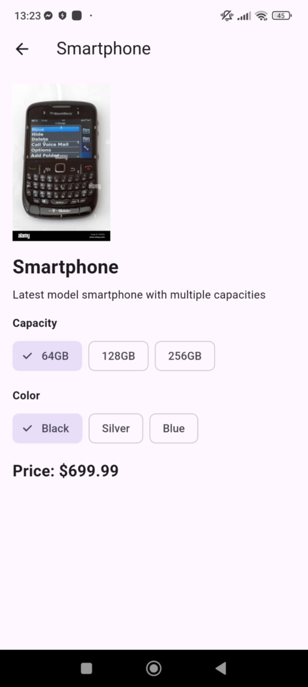
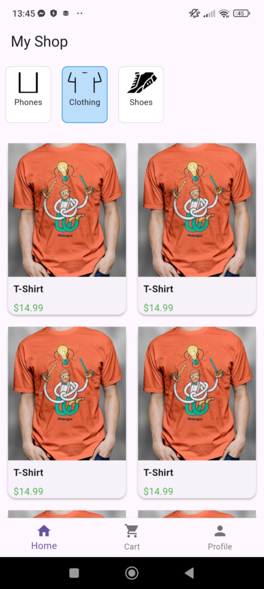

# Flutter E-Commerce App

[](https://flutter.dev/)
[](https://dart.dev/)
[](LICENSE)

A modern Flutter e-commerce app showcasing products and categories with dynamic variant pricing. Users can browse categories, view product details, and see updated prices when selecting variants. Designed for mobile and web.

---

## **Features**

- Browse product categories with images  
- View products filtered by category  
- Tap on products to view detailed information  
- Display product variants and dynamic pricing  
- Clean and responsive UI for mobile and web  

---

## **Screenshots**

### Home Screen


### Product Detail Screen


### Variant Selection


---

## **Tech Stack**

- Flutter  
- Dart  
- Provider (State Management)

## **Planned Improvements**
- Shopping cart functionality
- User authentication and login
- Integration with backend API for real product data
- Advanced search and filtering options
- Improved responsive design for web
---

## **Getting Started**

1. **Clone the repository:**  
```bash
git clone https://github.com/your-username/flutter_ecommerce_app.git
```

2. **Navigate to the project directory:**  
```bash
cd e-commerce-app-clone
```


3. **Install dependencies:**  
```bash
flutter pub get

```

4. **Run the app:**  
```bash
flutter run

```